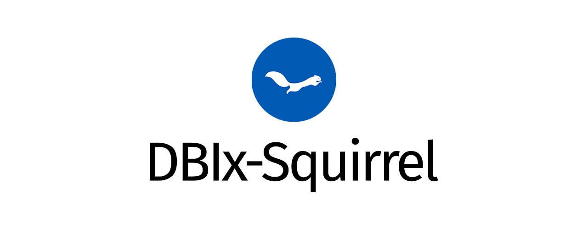

# NAME

DBIx::Squirrel - A module for working with databases

# VERSION

2020.11.00

# SYNOPSIS

    # Simply use the package.

    use DBIx::Squirrel;

    $dbh = DBIx::Squirrel->connect($dsn, $user, $pass, \%attr);
    $sth = $dbh->prepare('SELECT * FROM product WHERE id = ?');
    $res = $sth->execute('1001099');
    $itr = $sth->iterate('1001099');
    while ($row = $itr->next) {...}

    # Or, use it and have it create and import helper functions that you
    # can define at runtime use (and reuse) to interact with database
    # connections, statements and iterators.

    use DBIx::Squirrel 'db', 'st', 'it';

    db DBIx::Squirrel->connect($dsn, $user, $pass, \%attr);
    st db->prepare('SELECT * FROM product WHERE id = ?');
    $res = st->execute('1001099');
    $res = st('1001099');  # Same as line above.
    it st->iterate('1001099');
    while ($row = it->next) {...}

    # Clone another database connection.

    $dbi = DBI->connect($dsn, $user, $pass, \%attr);
    $dbh = DBIx::Squirrel->connect($dbi);

    # Prepare a statement object.

    $sth = $dbh->prepare($statement, \%attr);
    $sth = $dbh->prepare_cached($statement, \%attr, $if_active);

    # Commonly used positional and named parameter placeholder schemes
    # conveniently supported regardless of database driver in use.

    $sth = $dbh->prepare('SELECT * FROM product WHERE id = ?');
    $sth = $dbh->prepare('SELECT * FROM product WHERE id = ?1');
    $sth = $dbh->prepare('SELECT * FROM product WHERE id = $1');
    $sth = $dbh->prepare('SELECT * FROM product WHERE id = :1');
    $sth = $dbh->prepare('SELECT * FROM product WHERE id = :id');

    # Able to bind values to individual parameters for both positional
    # and named placeholder schemes.

    $sth->bind_param(1, '1001099');
    $sth->bind_param(':id', '1001099');
    $sth->bind_param('id', '1001099');

    # Bind multiple values to parameters in a single statement.

    $sth->bind( '1001099', ... );
    $sth->bind( [ '1001099', ... ] );
    $sth->bind( ':id' => '1001099', ... );
    $sth->bind( id => '1001099', ... );
    $sth->bind( { ':id' => '1001099', ... } );
    $sth->bind( { id => '1001099', ... } );

    # Or just have the statement handle's or iterator's "execute"
    # method bind all values to parameters by passing it the same
    # arguments you would pass to "bind".

    $res = $obj->execute( '1001099', ... );
    $res = $obj->execute( [ '1001099', ... ] );
    $res = $obj->execute( ':id' => '1001099', ... );
    $res = $obj->execute( id => '1001099', ... );
    $res = $obj->execute( { ':id' => '1001099', ... } );
    $res = $obj->execute( { id => '1001099', ... } );

    # The database handle "do" method works as it does with DBI,
    # with the exception that returns the result followed by the
    # statement handle when called in list-context. This means
    # we can use it to prepare and execute statements, before we
    # fetch results. Be careful to use "undef" if passing named
    # parameters in a hashref so they are not used as statement
    # attributes. The new "do" is smart enough not to confuse
    # other things as statement attributes.

    ($res, $sth) = $dbh->do(
        'SELECT * FROM product WHERE id = ?', '1001099'
    );
    ($res, $sth) = $dbh->do(
        'SELECT * FROM product WHERE id = ?', ['1001099']
    );
    ($res, $sth) = $dbh->do(
        'SELECT * FROM product WHERE id = :id', ':id' => '1001099'
    );
    ($res, $sth) = $dbh->do(
        'SELECT * FROM product WHERE id = :id', id => '1001099'
    );
    ($res, $sth) = $dbh->do( # ------------ undef or \%attr
        'SELECT * FROM product WHERE id = :id', undef,
        { ':id' => '1001099'}
    );
    ($res, $sth) = $dbh->do( # ------------ undef or \%attr
        'SELECT * FROM product WHERE id = :id', undef,
        { id => '1001099' },
    );

    # Statement objects can create iterators using the "iterate"
    # method (or its "it" alias). Use it as you would "execute"

    $itr = $sth->iterate( '1001099' );
    $itr = $sth->iterate(['1001099']);

    $itr = $sth->iterate( '1001099' );
    $itr = $sth->iterate(['1001099']);

    $itr = $sth->iterate( '1001099' );
    $itr = $sth->iterate(['1001099']);

    $itr = $sth->iterate( '1001099' );
    $itr = $sth->iterate(['1001099']);

    $itr = $sth->iterate( '1001099' );
    $itr = $sth->iterate(['1001099']);

    $itr = $sth->iterate( ':id' => '1001099' );
    $itr = $sth->iterate( id => '1001099' );

    $itr = $sth->iterate( { ':id' => '1001099' } );
    $itr = $sth->iterate( { id => '1001099' } );

    # Using the iterators couldn't be easier!

    @ary = ();
    while ($row = $itr->next) {
        push @ary, $row;
    }

    @ary = $itr->first;
    push @ary, $_ while $itr->next;

    @ary = $itr->first;
    push @ary, $itr->remaining;

    @ary = $itr->all;

    $itr = $itr->reset;     # Repositions iterator at the start
    $itr = $itr->reset({}); # Fetch rows as hashrefs
    $itr = $itr->reset([]); # Fetch rows as arrayrefs

    $row = $itr->single;
    $row = $itr->single( id => '1001100' );
    $row = $itr->single( { id => '1001100' } );
    $row = $itr->find( id => '1001100' );
    $row = $itr->find( { id => '1001100' } );

    # A result set is just fancy subclass of the iterator. It will
    # "bless" results, enabling us to get a column's value using an
    # accessor methods, without ever having to worry about whether
    # the row is a array or hash reference. While the accessor
    # methods use lowercase names, they will access the column's
    # value regardless of the case used.

    $sth = $dbh->prepare('SELECT MediaTypeId, Name FROM media_types');
    $res = $sth->rs;
    while ($res->next) {
        print $_->name, "\n";
    }

    # Iterators allow for the use of lambda functions to process
    # each row just in time during iteration.

    $it = $sth->iterate(
        sub { $_->{Name} }
    )->reset({});
    print "$_\n" foreach $it->all;

    # Lambdas may be chained.

    $res = $sth->rs(
        sub { $_->Name },
        sub { "Media type: $_" },
    );
    print "$_\n" while $res->next;

    print "$_\n" for $dbh->rs(
        q/SELECT MediaTypeId, Name FROM media_types/,
        sub { $_->Name },
    )->all;

    print "$_\n" for $dbh->select('media_types')->rs(
        sub { $_->Name },
    )->all;

# DESCRIPTION

**Just what the world needs — another Perl package for working with databases!**

`DBIx::Squirrel` is a `DBI` extension that serves as drop-in replacement for
`DBI`, while adding a few progressive enhancements to make some tasks much
easier.

# DESIGN

## Compatibility

DBIx-Squirrel's baseline behaviour is be like `DBI`.

A developer should be able to confidently replace `use DBI` with
`use DBIx::Squirrel`, while expecting their script to behave just
as it did before the change.

DBIx-Squirrel's enhancements are designed to be low-friction, intuitive, and
elective. Code using this package should behave like code using DBI, that is
until deviation from standard behaviour is expected and invited.

## Ease of use

An experienced user of DBI, or someone familiar with DBI's documentation,
should be able to use DBIx-Squirrel without any issues.

DBIx-Squirrel's enhancements are either additive or progressive. Experienced
DBI and DBIx-Class programmers should find a cursory glance at the synopsis
enough to get started in next to no time at all.

The intention has been for DBIx-Squirrel was to occupy a sweet spot between DBI
and DBIx-Class (though much closer to DBI).

# OVERVIEW

## Connecting to databases, and preparing statements

- The `connect` method continues to work as expected. It may also be invoked
with a single argument (another database handle), if the intention is to clone
that connection. This is particularly useful when cloning a standard DBI
database object, since the resulting clone will be a DBI-Squirrel
database object.
- Both `prepare` and `prepare_cached` methods continue to work as expected,
though passing a statement handle, instead of a statement in a string, results
in that statement being cloned. Again, this is useful when the intention is to
clone a standard DBI statement object in order to produce a DBIx-Squirrel
statement object.

## Parameter placeholders, bind values, and iterators

- Regardless of the database driver being used, DBIx-Squirrel provides full,
baseline support for five parameter placeholder schemes (`?`, `?1`,
`$1`, `:1`, `:name`), offering a small degree of code portability to
programmers with standard SQL, SQLite, PostgreSQL and Oracle backgrounds.
- A statement object's `bind_param` method will continue to work as expected,
though its behaviour has been progressively enhanced. It now accommodates
both `bind_param(':name', 'value')` and `bind_param('name', 'value')`
calling styles, as well as the `bind_param(1, 'value')` style for
positional placeholders.
- Statement objects have a new `bind` method aimed at greatly streamlining
the binding of values to statement parameters.
- A statement object's `execute` method will accept any arguments you would
pass to the `bind` method. It isn't really necessary to call `bind` because
`execute` will take care of that.
- DBIx-Squirrel iterators make the traversal of result sets simple and
efficient, and these can be generated by using a statement object's
`iterate` method in place of `execute`, with both methods taking
the same arguments.
- Some DBIx-Squirrel iterator method names (`reset`, `first`, `next`,
`single`, `find`, `all`) may be familiar to other DBIx-Class
programmers who use them for similar purposes.

# COPYRIGHT AND LICENSE

    Copyright (c) 2020-2024 Iain Campbell

    This program is free software: you can redistribute it and/or modify
    it under the terms of the GNU General Public License as published by
    the Free Software Foundation, either version 3 of the License, or
    (at your option) any later version.

    This program is distributed in the hope that it will be useful,
    but WITHOUT ANY WARRANTY; without even the implied warranty of
    MERCHANTABILITY or FITNESS FOR A PARTICULAR PURPOSE.  See the
    GNU General Public License for more details.

    You should have received a copy of the GNU General Public License
    along with this program.  If not, see <https://www.gnu.org/licenses/>.

